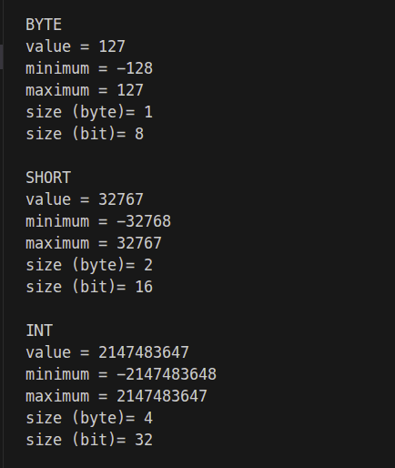

# Tipe Data
telah kita ketahui bersama bahwa tipe data pada dasarnya di bagi menjadi 2 jenis yaitu primitive & non primitive.

### Primitif (8 Jenis)
Tipe data ini telah ditentukan sebelumnya oleh bahasa Java dan menyimpan nilai tunggal. 
- **byte:** Bilangan bulat 8-bit (rentang -128 s/d 127).
- **short:** Bilangan bulat 16-bit (rentang -32.768 s/d 32.767).
- **int:** Bilangan bulat 32-bit (standar, -2^31 s/d 2^31-1).
- **long:** Bilangan bulat 64-bit (untuk nilai besar).
- **float:** Bilangan pecahan 32-bit (desimal presisi tunggal).
- **double:** Bilangan pecahan 64-bit (standar desimal, lebih presisi).
- **char:** Karakter tunggal 16-bit (Unicode).
- **boolean:** Logika (hanya bernilai true atau false). 

### Non-Primitif (Tipe Referensi)
Tipe ini dibuat oleh programmer (kecuali String) dan merujuk pada objek. 

- **String:** Urutan karakter (contoh: "Hello World").
- **Array:** Koleksi data dengan tipe yang sama.
- **Class:** Cetak biru (blueprint) objek.
- **Interface:** Kontrak perilaku yang diimplementasikan oleh kelas.
- **Enum:** Kumpulan konstanta tetap. 

### Contoh Coding
bagi yang belum faham disini saya memakai printf (metode untuk mencetak ke layar dengan format khusus sesuai type data yang digunakan). coding lengkapnya bisa di lihat di [type_data.java](type_data.java)

```java
byte type_byte = 127;
        System.out.printf(
                "BYTE\nvalue = %d\nminimum = %d\nmaximum = %d\nsize (byte)= %d\nsize (bit)= %d\n\n",
                type_byte,
                Byte.MIN_VALUE,
                Byte.MAX_VALUE,
                Byte.BYTES,
                Byte.SIZE);
```

hasil output terminalnya adalah :

