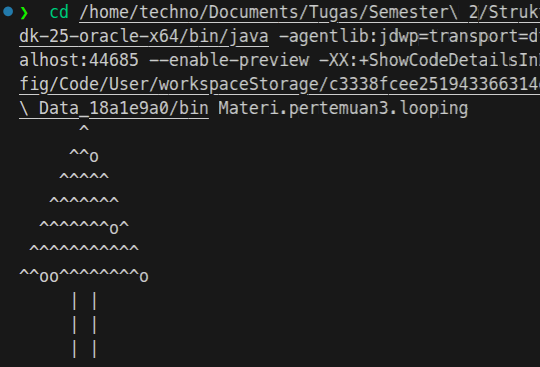

# Operator Relasional, Operator Logika, dan Looping di Java

Operator relasional dan operator logika merupakan komponen fundamental dalam **kontrol alur (control flow)** pada Java. Keduanya digunakan untuk menghasilkan nilai boolean (`true` / `false`) yang kemudian menentukan eksekusi blok program seperti:

- `if`
- `if-else`
- `switch`
- `while`
- `do-while`
- `for`

Operator relasional membandingkan dua nilai, sedangkan operator logika mengombinasikan ekspresi boolean.


## 1. Operator Relasional (Comparison / Relational Operators)

Digunakan untuk membandingkan dua operand dan menghasilkan nilai boolean.

| Operator | Deskripsi                    | Contoh   | Hasil   |
|-- |- |-- |- |
| `==`     | Sama dengan                  | `5 == 5` | `true`  |
| `!=`     | Tidak sama dengan            | `5 != 3` | `true`  |
| `>`      | Lebih besar                  | `5 > 6`  | `false` |
| `<`      | Lebih kecil                  | `5 < 6`  | `true`  |
| `>=`     | Lebih besar atau sama dengan | `5 >= 3` | `true`  |
| `<=`     | Lebih kecil atau sama dengan | `3 <= 5` | `true`  |

### Catatan Penting

- `==` membandingkan **nilai** pada tipe primitif.
- Untuk objek (misalnya `String`), `==` membandingkan referensi, bukan isi objek.
- Untuk membandingkan isi objek gunakan `.equals()`.


## 2. Operator Logika (Logical Operators)

Digunakan untuk mengombinasikan dua atau lebih ekspresi boolean.

<table>
    <tr>
        <th>Operator</th>
        <th>Nama</th>
        <th>Deskripsi</th>
        <th>Contoh</th>
    </tr>
    <tr>
        <td><code>&amp;&amp;</code></td>
        <td>Logical AND</td>
        <td>Bernilai <code>true</code> jika kedua kondisi bernilai <code>true</code></td>
        <td>(x &lt; 5 &amp;&amp; y &gt; 10)</td>
    </tr>
    <tr>
        <td><code>||</code></td>
        <td>Logical OR</td>
        <td>Bernilai <code>true</code> jika salah satu kondisi bernilai <code>true</code></td>
        <td>(x &lt; 5 || y &gt; 10)</td>
    </tr>
    <tr>
        <td><code>!</code></td>
        <td>Logical NOT</td>
        <td>Membalik nilai boolean (<code>true</code> menjadi <code>false</code>)</td>
        <td>!(x &gt; 5)</td>
    </tr>
    <tr>
        <td><code>^</code></td>
        <td>Logical XOR</td>
        <td><code>true</code> jika hanya satu kondisi bernilai <code>true</code></td>
        <td>(a &gt; b ^ b &gt; c)</td>
    </tr>
</table>

### Contoh Evaluasi

```java
boolean hasil = (5 > 3) && (10 < 20);
// true && true → true
```


## 3. Short-Circuit Evaluation

Java menggunakan mekanisme short-circuit pada:

- `&&`
- `||`

Artinya:

- Pada `&&`, jika kondisi pertama `false`, kondisi kedua tidak dievaluasi.
- Pada `||`, jika kondisi pertama `true`, kondisi kedua tidak dievaluasi.

Contoh:

```java
int x = 5;

if (x > 10 && x++ > 3) {
    System.out.println("True");
}

// x tidak akan bertambah karena kondisi pertama sudah false
```


## 4. Penggunaan dalam Percabangan (Conditional Statement)

```java
int a = 10;
int b = 20;

if (a < 15 && b > 15) {
    System.out.println("Kondisi terpenuhi");
}
```

Evaluasi:

- `a < 15` → true
- `b > 15` → true
- true && true → true

Blok `if` akan dijalankan.


## 5. Penggunaan dalam Looping

Operator relasional dan logika sering digunakan sebagai kondisi perulangan.

### Contoh `while`

```java
int i = 0;

while (i < 5) {
    System.out.println(i);
    i++;
}
```

### Contoh `for`
untuk contoh pemakaian for, pembanding serta logika dalam saat yang sama bisa cek file [looping.java](looping.java)

hasil outputnya adalah:


## Kesimpulan

- Operator relasional membandingkan nilai.
- Operator logika menggabungkan kondisi boolean.
- Keduanya menghasilkan nilai boolean (`true` / `false`).
- Digunakan dalam struktur kontrol seperti `if`, `while`, dan `for`.
- `&&` dan `||` menggunakan short-circuit evaluation.

