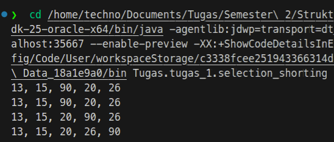

# Selection Shorting

tugas 1 kita adalah selection shorting dimana terdapat sebuah variable x berisi [20,15, 90, 13, 26]

dimana kita harus memakai selection shorting untuk mengurutkannya. berikut adalah coding utamanya :

```java
// deklarasi variabel utama
int[] x = { 20, 15, 90, 13, 26 };
int n = x.length;
int temp = 0

for (int i = 0; i < n - 1; i++) {
    int min = i;
    // mencari nilai terkecil dri sebuah array
    for (int j = i + 1; j < n; j++) {
        if (x[j] < x[min]) {
            min = j;
        }
    }
    // menukar nilai jika nilai min terindikasi tidak sama dengan i
    if (min != i) {
        temp = x[i];
        x[i] = x[min];
        x[min] = temp;
    }
    // menampilkan hasil per step
    for (int o = 0; o < n; o++) {
        System.out.print(x[o] + (o == n - 1 ? "\n" : ", "));
    }
}
```
saya memakai pendekatan nested loop dimana pada `loop ke 1` berfungsi untuk membaca nilai dari setiap index array & `loop yang ke 2` berfungsi untuk mengecek nilai terkecil dari sebuah array.

setelah nilai terkecil pertama diketahui indexnya akan diambil kemudian memakai variable temp untuk menukar nilai array.

setelah penukaran dilakukan saya menampilkan kembali masing-masing iterasinya untuk melihat apakah perubahan terjadi atau tidak.

# Hasil
