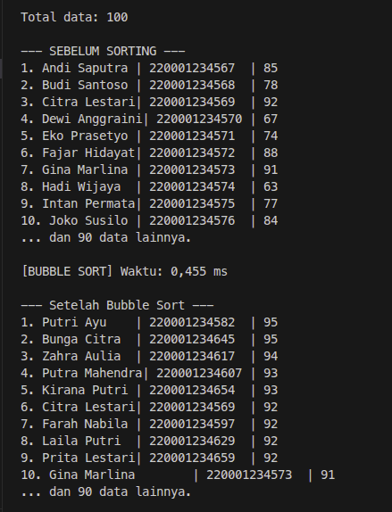
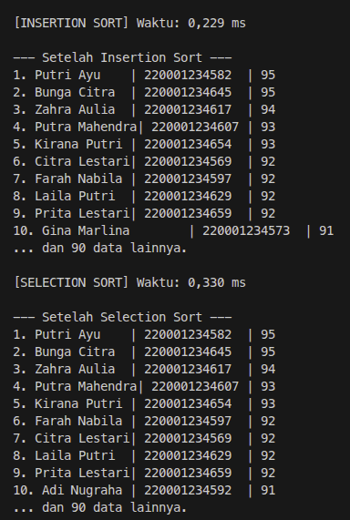

# Tugas UTS

<table>
    <tr>
        <td rowspan="2"></td>
        <th>Nama :</th>
        <td>Fahmi Nur Fadillah</td>
    </tr>
    <tr>
        <th>NPM :</th>
        <td>25161562034</td>
    </tr>
</table>

## Praktikum UTS :

- menyiapkan data acak dalam 3 jenis yaitu **nama (String), NPM (Int), Nilai (Int)**
- **membuat program** : bubble short, insertion short & selection short

**Inisiatif & Optimasi :**

- menggunakan file [data.csv](data.csv) untuk menyimpan data
- menggunakan oop & formating untuk tampilan agar lebih menarik

## Import Library & Penggunaan nya

Diperlukan beberapa library bawaan java seperti io & utils. Untuk importnya sebenarnya bisa langsung memakai metode `java.io.*` tapi disini saya jabarkan untuk dokumentasi serta karena bawaan extensi java di vscode saya untuk auto sugest.

```java
import java.io.BufferedReader;
import java.io.FileReader;
import java.io.IOException;
import java.util.ArrayList;
import java.util.List;
```

semua library itu diperlukan untuk membaca & mengolah bagaimana data di urutkan serta ditampilkan

```java
public static Mahasiswa[] bacaCSV(String filePath) throws IOException {
    List<Mahasiswa> list = new ArrayList<>();
    try (BufferedReader br = new BufferedReader(new FileReader(filePath))) {
        String line;

        br.readLine(); // skip header

        while ((line = br.readLine()) != null) {
            String[] parts = line.split(",");
            if (parts.length < 3) continue; // skip baris tidak valid
            String nama = parts[0].trim();
            String nim = parts[1].trim();
            int nilai = Integer.parseInt(parts[2].trim());
            list.add(new Mahasiswa(nama, nim, nilai));
        }
    }
    return list.toArray(new Mahasiswa[0]);
}
```

## **Penggunaan OOP**

Saya menggunakan **2 class** & **kurang lebih 7 method**

### 📌 **Class yang Digunakan**

1. **`Mahasiswa`** – kelas untuk merepresentasikan entitas data (nama, nim, nilai).
2. **`SortingUTS`** – kelas utama yang berisi logika sorting dan eksekusi program.

### 📌 **Method dalam Class `Mahasiswa`**

| Method                           | Fungsi                                                                                                     |
| -------------------------------- | ---------------------------------------------------------------------------------------------------------- |
| `Mahasiswa(String, String, int)` | **Constructor** – menginisialisasi objek mahasiswa.                                                        |
| `toString()`                     | **Override** – mengembalikan representasi string objek (nama \| nim \| nilai) untuk memudahkan pencetakan. |

### 📌 **Method dalam Class `SortingUTS`**

| Method                             | Fungsi                                                                                                                |
| ---------------------------------- | --------------------------------------------------------------------------------------------------------------------- |
| `bubbleSort(Mahasiswa[])`          | Mengurutkan array mahasiswa berdasarkan **nilai** menggunakan algoritma Bubble Sort (dengan optimasi _swapped flag_). |
| `insertionSort(Mahasiswa[])`       | Mengurutkan array mahasiswa berdasarkan **nilai** menggunakan algoritma Insertion Sort.                               |
| `selectionSort(Mahasiswa[])`       | Mengurutkan array mahasiswa berdasarkan **nilai** menggunakan algoritma Selection Sort.                               |
| `bacaCSV(String)`                  | **Static method** – membaca file CSV, memparsing tiap baris menjadi objek `Mahasiswa`, mengembalikan `Mahasiswa[]`.   |
| `cetakSampel(Mahasiswa[], String)` | **Static method** – menampilkan maksimal 10 data pertama dari array, dengan judul tertentu (untuk verifikasi).        |
| `main(String[])`                   | Entry point program – memanggil semua method di atas, mengukur waktu eksekusi, dan menampilkan hasil.                 |

### 🧠 **Konsep OOP yang Diterapkan**

- **Encapsulation** – data (nama, nim, nilai) dibungkus dalam class `Mahasiswa`.
- **Abstraction** – method `bubbleSort`, `insertionSort`, `selectionSort` menyembunyikan detail implementasi sorting.
- **Object & Class** – menggunakan objek `Mahasiswa` untuk menyimpan data, bukan variabel terpisah.
- **Constructor** – memudahkan pembuatan objek saat parsing CSV.
- **Method Overriding** – `toString()` disesuaikan untuk kebutuhan formating output.

## Main Logic Program Shorting

### Bubble Short

```java
public static void bubbleSort(Mahasiswa[] arr) {
    int n = arr.length;
    for (int i = 0; i < n - 1; i++) {
        boolean swapped = false;
        for (int j = 0; j < n - i - 1; j++) {
            if (arr[j].nilai < arr[j + 1].nilai) {
                Mahasiswa temp = arr[j];
                arr[j] = arr[j + 1];
                arr[j + 1] = temp;
                swapped = true;
            }
        }
        if (!swapped) break; // berhenti jika sudah terurut
    }
}
```

### Insertion Short

```java
public static void insertionSort(Mahasiswa[] arr) {
    for (int i = 1; i < arr.length; i++) {
        Mahasiswa key = arr[i];
        int j = i - 1;
        while (j >= 0 && arr[j].nilai < key.nilai) {
            arr[j + 1] = arr[j];
            j--;
        }
        arr[j + 1] = key;
    }
}
```

### Selection Short

```java
public static void selectionSort(Mahasiswa[] arr) {
    for (int i = 0; i < arr.length - 1; i++) {
        int minIdx = i;
        for (int j = i + 1; j < arr.length; j++) {
            if (arr[j].nilai > arr[minIdx].nilai) {
                minIdx = j;
            }
        }
        Mahasiswa temp = arr[minIdx];
        arr[minIdx] = arr[i];
        arr[i] = temp;
    }
}
```

## Output
Jika kita cermati lebih lanjut memang terdapat perbedaan urutan dalam shortingnya. Ini terjadi karena perbedaan metode shorting & kita hanya berfokus untuk short pada variabel nilai
<table>
    <tr>
        <td></td>
        <td></td>
    </tr>
</table>
